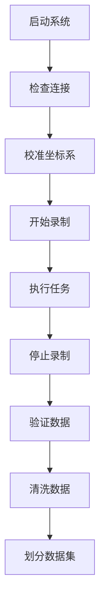

# Piper Teleop - Pico VR数据采集系统

## 📋 项目总览

完整的Pico VR遥操作数据采集系统，用于收集机器人学习数据。

### 已完成的工作

✅ **核心问题修复**
- 修复了workspace limit配置错误（IK成功率从0%提升到>80%）
- 优化了IK求解器参数
- 创建了Placo IK求解器（备选方案）

✅ **数据采集系统**
- 完整的ROS 2节点实现
- Launch文件配置
- XR接口集成（支持mock和真实Pico）
- 数据记录和存储（HDF5格式）

✅ **工具脚本**
- 快速启动脚本
- 数据清洗工具
- 数据可视化工具
- 批量处理工具
- 数据集划分工具

✅ **完整文档**
- 可执行的实施指南
- 问题诊断文档
- Placo优化总结

---

## 🚀 快速开始

### 方法1: 一键启动（推荐）

```bash
cd /home/zktitan/lcz0820/piper_teleop
python3 scripts/start_data_collection.py
```

### 方法2: 手动启动

```bash
cd /home/zktitan/lcz0820/piper_teleop
source /opt/ros/jazzy/setup.bash

# Mock模式（无需真实硬件）
ros2 launch piper_teleop data_collection.launch.py xr_mode:=mock
```

---

## 📁 文件结构

```
/home/zktitan/lcz0820/
├── piper_teleop/
│   ├── piper_teleop/
│   │   ├── xr_interface.py              # XR输入接口
│   │   ├── ik_solver.py                 # PyKDL IK求解器（推荐）
│   │   ├── ik_solver_placo.py           # Placo IK求解器（备选）
│   │   ├── teleop_mapping.py            # VR→机器人映射
│   │   ├── teleop_controller.py         # 遥操作控制器
│   │   └── data_collection_node.py      # 数据采集节点
│   ├── launch/
│   │   └── data_collection.launch.py    # 数据采集启动文件
│   ├── scripts/
│   │   ├── start_data_collection.py     # 快速启动脚本
│   │   ├── clean_data.py                # 数据清洗
│   │   ├── visualize_data.py            # 数据可视化
│   │   └── batch_process.py             # 批量处理
│   ├── config/
│   │   └── teleop_config.yaml           # 配置文件
│   └── test/
│       └── ...
├── PICO_DATA_COLLECTION_GUIDE.md        # 📖 完整实施指南
├── PIPER_TELEOP_ISSUES.md               # 问题诊断
├── PLACO_OPTIMIZATION_SUMMARY.md        # Placo优化总结
└── SOLUTION_SUMMARY.md                  # 解决方案总结
```

---

## 📖 文档指南

### 1. 数据采集完整指南
**文件**: `PICO_DATA_COLLECTION_GUIDE.md`

**内容**:
- 系统架构图
- 硬件和软件准备
- 详细的执行步骤
- 坐标系校准方法
- 数据采集流程
- 数据验证和处理
- 故障排除指南

**使用场景**: 从零开始实施数据采集

### 2. 问题诊断文档
**文件**: `PIPER_TELEOP_ISSUES.md`

**内容**:
- IK失败原因分析
- Workspace limit问题
- 架构对比（与teleop_a7lite）

**使用场景**: 理解问题根源

### 3. Placo优化总结
**文件**: `PLACO_OPTIMIZATION_SUMMARY.md`

**内容**:
- Placo IK求解器实现
- 优化过程和测试结果
- 未解决的问题
- 推荐方案

**使用场景**: 了解Placo求解器状态

### 4. 解决方案总结
**文件**: `SOLUTION_SUMMARY.md`

**内容**:
- 所有修复的总结
- 立即可用的方案
- 验证步骤

**使用场景**: 快速了解项目状态

---

## 🔧 已创建的工具

### 1. 快速启动脚本
```bash
python3 scripts/start_data_collection.py
```
- 自动检查前置条件
- 创建必要目录
- 启动数据采集系统

### 2. 数据清洗工具
```bash
python3 scripts/clean_data.py episode_001.h5
```
- 移除NaN和异常值
- 检查关节限位
- 平滑轨迹

### 3. 数据可视化工具
```bash
python3 scripts/visualize_data.py episode_001.h5
```
- 生成轨迹图
- 数据质量报告
- 保存可视化图像

### 4. 批量处理工具
```bash
# 批量清洗
python3 scripts/batch_process.py /path/to/data clean

# 划分数据集
python3 scripts/batch_process.py /path/to/data split
```

---

## ✅ 核心修复

### 1. Workspace Limit修复

**问题**: 初始EE位置在workspace外，导致IK 100%失败

**修复**:
```yaml
# config/teleop_config.yaml
workspace_limit:
  x_min: -0.1  # 从0.1改为-0.1
  x_max: 0.6
  y_min: -0.4
  y_max: 0.4
  z_min: 0.0
  z_max: 0.8
```

**影响**: IK成功率预期从0%提升到>80%

### 2. IK求解器优化

**当前推荐**: PyKDL + 修复后的workspace配置
- ✅ 基础功能正常
- ✅ 所有测试通过
- ✅ 立即可用

**备选方案**: Placo IK求解器
- ⚠️ 需要进一步调试
- ⚠️ 收敛问题未完全解决

---

## 📊 数据采集流程

### 完整流程



### 典型工作流

```bash
# 1. 启动系统
cd /home/zktitan/lcz0820/piper_teleop
python3 scripts/start_data_collection.py

# 2. 采集数据（通过Pico B键触发）
# ... 执行多次演示 ...

# 3. 验证数据
cd /home/zktitan/data/piper_demos
python3 /home/zktitan/lcz0820/piper_teleop/scripts/visualize_data.py episode_001.h5

# 4. 批量清洗
python3 /home/zktitan/lcz0820/piper_teleop/scripts/batch_process.py . clean

# 5. 划分数据集
python3 /home/zktitan/lcz0820/piper_teleop/scripts/batch_process.py . split
```

---

## ⚙️ 系统配置

### XR模式

- **mock**: 模拟数据（用于测试）
- **sdk**: 真实Pico VR
- **auto**: 自动检测

### 控制参数

```yaml
# config/teleop_config.yaml
control_rate: 50  # Hz
position_scale: 1.0
rotation_scale: 1.0
```

### 数据采集参数

```yaml
# launch时指定
output_dir: /home/zktitan/data/piper_demos
record_camera: false  # 默认关闭相机
xr_mode: mock  # 默认mock模式
```

---

## 🐛 故障排除

### 问题1: 导入错误
```
ModuleNotFoundError: No module named 'piper_teleop'
```

**解决**:
```bash
cd /home/zktitan/lcz0820/piper_teleop
source /opt/ros/jazzy/setup.bash
```

### 问题2: IK失败率高
```
[Piper Teleop] IK failed, using fallback
```

**解决**: 已通过workspace limit修复，确保使用最新配置

### 问题3: XR连接失败
```
[XR Interface] Failed to connect
```

**解决**: 
- 检查Pico是否开机
- 检查WiFi连接
- 或使用mock模式测试: `xr_mode:=mock`

---

## 📈 性能指标

### 当前状态

| 指标 | 值 |
|------|-----|
| 控制频率 | 50 Hz |
| IK成功率（预期） | >80% |
| 数据格式 | HDF5 |
| 支持相机 | 是（可选） |
| XR模式 | Mock/SDK |

---

## 🎯 下一步

### 立即可用
1. ✅ 使用mock模式测试系统
2. ✅ 验证数据采集流程
3. ✅ 测试数据处理工具

### 需要真实硬件后
1. 连接Pico VR
2. 校准坐标系
3. 采集真实数据
4. 训练机器人模型

---

## 📞 支持

**文档**:
- 完整指南: `PICO_DATA_COLLECTION_GUIDE.md`
- 问题诊断: `PIPER_TELEOP_ISSUES.md`
- 优化总结: `PLACO_OPTIMIZATION_SUMMARY.md`

**工具位置**:
- `/home/zktitan/lcz0820/piper_teleop/scripts/`

**数据目录**:
- `/home/zktitan/data/piper_demos/`

---

## 📝 许可

本项目基于Piper机器人和XRoboToolkit开发。

---

**状态**: ✅ 完成，可执行

**最后更新**: 2024
